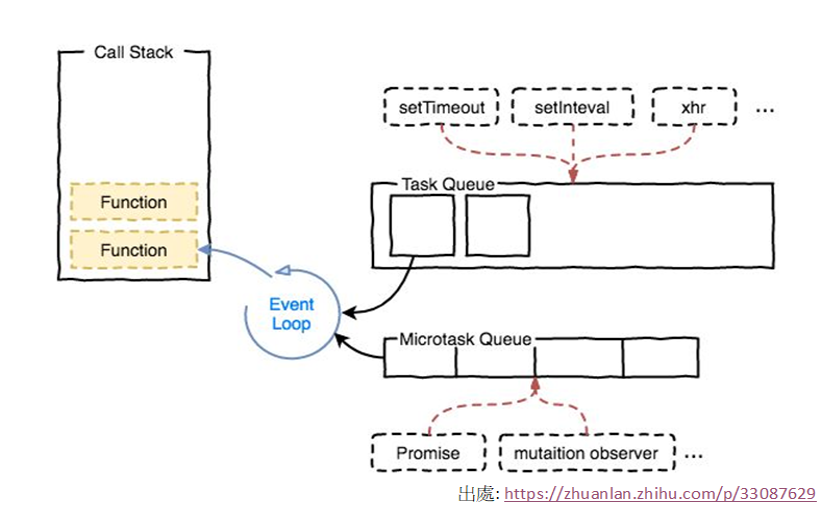

### 1. 假設NodeJS的fs module中只提供fs.readFileSync()來讀取檔案, 請問若想以非同步的方式讀取檔案的話, 可以怎麼做

```
var fs = require('fs');
function readfile (file, callback) {
  try {
    let content = fs.readFileSync(file);
    callback(null, content.toString());
  } catch (err) {
    callback(err);
  }
}
readfile('test1.js', function (err, result) {
  if (err) {
    console.error(err);
  }
  console.log(result);
});
```

### 2. 請盡可能詳細說明Eventloop的概念

因為JavaScript設計之初是single thread, 因此為了不會阻塞main thread, 就使用Event Loop機制.
同步任務放在main thread而非同步任務則根據類型不同分別進入不同的queue.
1.  JavaScript的main thread會先將記憶體stack中的function清空
2.	檢查microtask queue是否為空, 若不為空則將microtask queue中的function放入stack執行, 依次執行直到microtask queue被清空
3.  檢查task queue是否為空, 若不為空則每一次loop只會從task queue讀取一個function, 將該function放入stack執行
4.	接著再檢查microtask queue是否為空, 若不為空則將microtask queue中的function放入stack執行, 依次執行直到microtask queue被清空
5.  然後重複3和4,直到task queue被清空

* task queue: setTimeout, setInterval, setImmediate, I/O, UI rendering

* microtask queue: process.nextTick, Promises (node環境下, process.nextTick的優先順序高於Promise)




### 3. 請於下頁程式碼中實作sumV1AndV2()和start()

```
var v1, v2;
function generateRandomNumber () {
  return Math.floor(Math.random() * 10) + 1;
}
function assign10ToV1 () {
  const latency = generateRandomNumber();
  setTimeout(() => {
    v1 = 10;
  }, latency * 1000);
}
function assign20ToV2 () {
  const latency = generateRandomNumber();
  setTimeout(() => {
    v2 = 20;
  }, latency * 1000);
}

function sumV1AndV2 () {
  return new Promise((resolve, reject) => {
    assign10ToV1();
    assign20ToV2();

    let timer = setInterval(() => {
      if (v1 !== undefined && v2 !== undefined) {
        clearInterval(timer);
        resolve(v1 + v2);
      }
    }, 1000);
  });
}

async function start () {
  let sum = await sumV1AndV2();
  console.log(sum);
}

start();

// sumV1AndV2()
// 此方法不需要傳入參參數
// 此方法被執行時必須先呼叫assign10ToV1()和assign10ToV2()
// 此方法會回傳v1 + v2的結果
// start()
// 此方法為程式的進入點不需要傳入參數
// 請在此方法中呼叫sumV1AndV2()並在console中印出

```

### 4. 請說明Closures的概念, 可以的話請提供使用範例

閉包（Closure）是function以及該function被宣告時所在的作用域環境的組合.

#### 存取的範疇即是其被宣告後往外推的範圍

```
function init () {
  let color = 'red'; // 宣告在displayColor外部的變數
  function displayColor () {
    console.log(color); //可存取宣告displayColor外部的變數
  }
  displayColor();
}
init(); //red
```

#### 每次函式被呼叫時, 都會創造一組新的環境

```
function makeSum(x) {
  function add(y) {
    return x+y;
  }
  return add;
}
let add1 = makeSum (1);
let add2 = makeSum (2);

add1(6); =>> 7
add2(6); =>> 8
```
因為add1和add2都是閉包, 所以他們被創造時會記住宣告當下的環境, 包括變數x.
對 add1 而言, x = 1
對 add2 而言, x = 2


#### 應用: 使用閉包達到資料隔離的效果

```
let makeDrink = function () {
  let drink = '';
  function order(val) {
    drink = val;
    console.log(drink);
    }

  return {
    makeBlacktea: function () {
      order('Blacktea');
    },
    makeGreentea: function () {
      order('Greentea');
    },
    show: function () {
      console.log('show' + drink);
    }
  }
}

let drink1 = makeDrink();
let drink2 = makeDrink();

drink1.makeGreentea(); //Greentea
drink2.makeBlacktea(); //Blacktea
drink1.show(); //showGreentea
drink2.show(); //showBlacktea

```